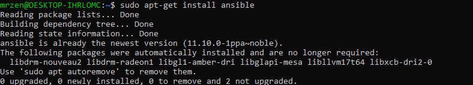
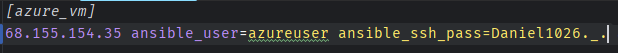
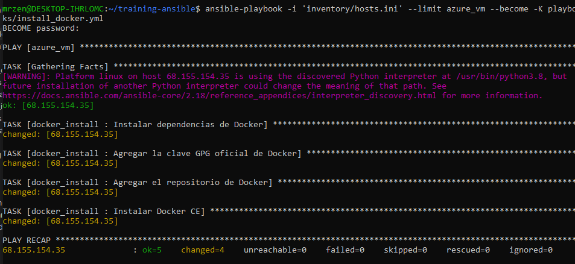
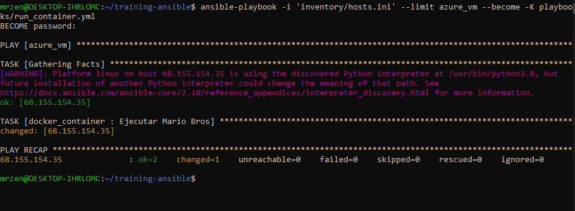
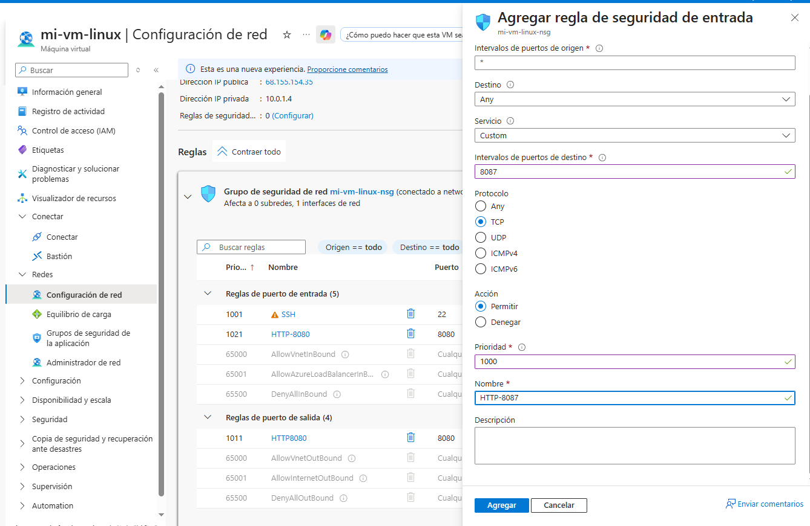
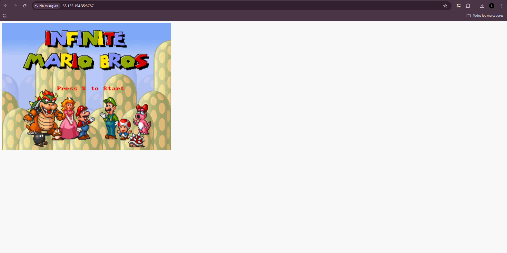

# training-ansible

## Primer paso instalación de Ansible

```bash
sudo apt update
sudo apt install software-properties-common
sudo add-apt-repository --yes --update ppa:ansible/ansible
```


Usaremos la siguiente maquina virtual


y adaptamos nuestro host.ini a esta maquina virtual


## Segundo paso: Instalar docker



## Tercer paso: Ejecutar el contenedor



Pero si intentamos acceder en este momento no nos muestra nada :(

Esto se debe a que el puerto 8080 y 8087 no esta abierto en la maquina virtual Asi que vamos a abrirlo



Despues de esto ya podemos acceder al contenedor y ejecutar en web


